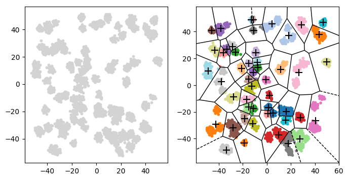

### Clustering analysis

Clustering algorithms aim to find groups (clusters) within a data-set whereby each group contains the objects that are the most similar to each other. Clustering has applications in machine learning (feature learning), data-mining (non-random sampling) and vector quantization (data compression).

One of its simplest implementations is _k_--means clustering, which aims to group the data-sets into _k_ clusters where data-points are assigned to the group with the closest centroid to them. Essentially, **given a set of _n_ observations, we want to group these observations into _k_ clusters so that the variance within each group is minimised**. While this turns out to be an NP-hard problem, there are a number of algorithms that are able to obtain approximate answers. 

We will use a version of Lloyd's algorithm, which is one of the most simple implemntations of _k_--means, to find clusters within a mock dataset. It goes something like this:

1. Initialise by picking _k_ random data points to be the initial centroids (where _k_ = number of groups).
2. Then, for each data-point, compute the Euclidian distance, $\sqrt((x_{data}-x_{centroid})^2 + (y_{data}-y_{centroid})^2)$, from the centroid of each group.
3. Assign each data-point to the group that it is closest to.
4. Using the new group assignments, compute new centroids for each group using the mean of its constituent data-points.
5. Repeat steps 2-4 until the group assignments no longer change.
6. Then return the centroids of each group and the group assignment of each data-point.

Write your solution in `solution.py`
Run `run.py` to see if your solution works!

It should look something like this:

