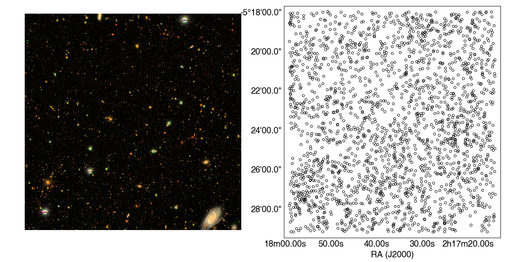

# Task 13: nearest neighbour search

Nearest neighbour searches are often used in astronomy to match detected sources to objects in a catalogue. In this task we will attempt to match a target position to a catalogue from the Hyper Suprime-Cam UltraDeep survey.

The figure below shows a small region of the HSC-SSP survey with all of the sources with g band surface brightnesses above 24 mag arcsec^{2} marked in the right hand plot. 

The aim is to write a function (nearest_neighbour) that, given a target RA and Dec 'target_X', returns the index of the closest pair of RA and Dec from a catalogue of sources, 'X'.

There are a number of different ways of doing this (see https://en.wikipedia.org/wiki/Nearest_neighbor_search) the most simple being a linear search. Try implementing one of the faster methods if you like.

Write your solution in the `solution.py` file.