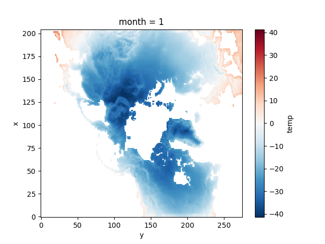
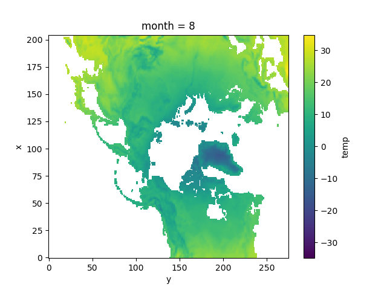

# Task 14: Handling big data on a grid

Say you have generated the output of a simulation or a bunch of simulations. 
Now you want to aggregate your multidimensional data and plot your results but all the data is in loads of different files with different names!

How do you read in the results elegantly?

How do you aggregate over all the dimensions?

## The Task
This task uses temperature data taken over a year for a region. 
Your job is to read in the data and plot the average temperature for a given month number (e.g. February=2).
The catch is that the temperatures are stored in one 2d array for each time and the x/y coordinates are stored in similar separate files for each time.
You need to read in those text files, aggregate them together in some meaningful sense, take the mean temperature (over x and y) for each month, and then plot that temperature in a 2D map for a given month.

`run.py` contains the code to run the task. Don't change it just look at what it does. 

`solution.py` is where you write your functions. I've started you off with some helpful functions already.

Have fun!

