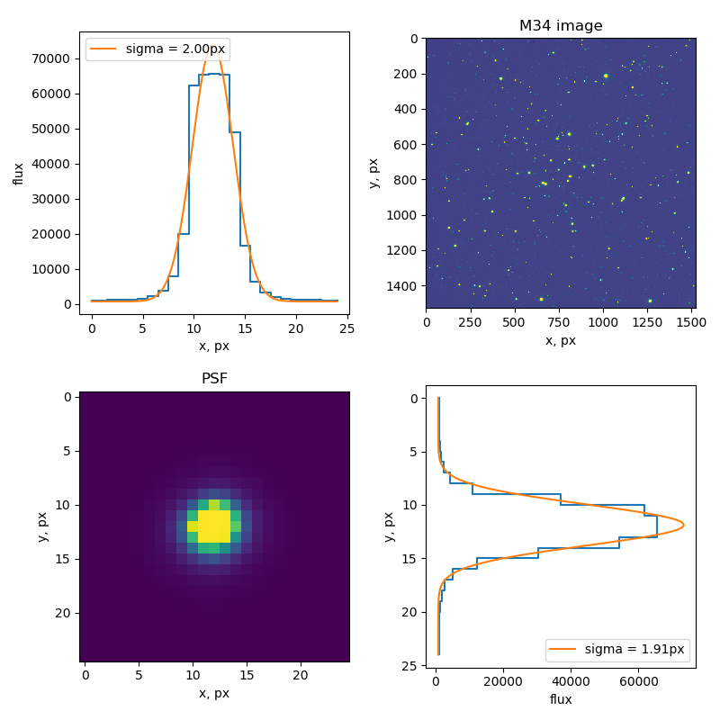

# Task 15: Measuring a PSF from image

The task is to write a function `estimate_psf()` in the file `solution.py`. It takes a image as a 2D array and returns an image of the PSF as a 2D array.

The way to do it is to detect stars, cut out stamps from the original image, centered on the stars, and stack them (mean? median?).

There are many ways to detect stars in an image, we did it in [Task 1](https://github.com/herts-astrostudents/Code-Review/tree/master/Task%201), and you can write your own code to do it if you have time and inspiration, but you could also use the [thing from photutils](https://photutils.readthedocs.io/en/stable/detection.html).

By default it downloads images from [Bayfordbury server](https://observatory.herts.ac.uk/telescopes/imagesearch.php), but you can set `real_images = False` in `run.py` if you want to use synthetic image with Gaussian stars (code recycled from the Task 1, thanks Shaun).

The result will look like this:
