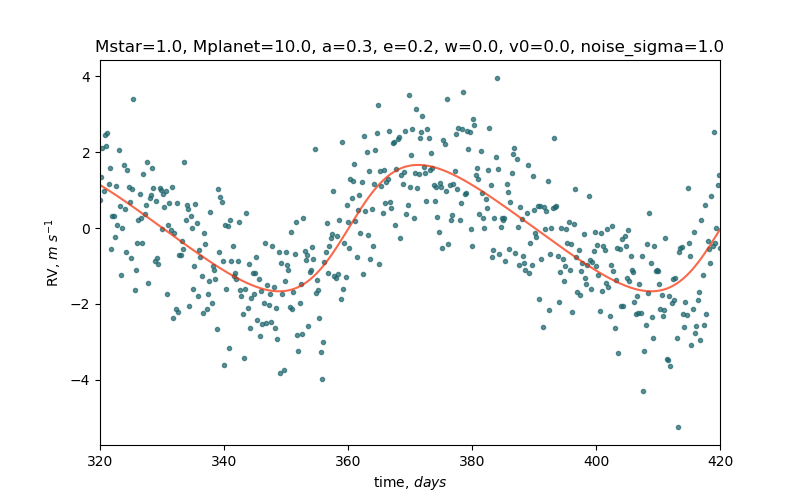

# Task 16: Introduction to Classes and inheritance

The code in `simulation.py` simulates radial velocity of a star due to a planet orbiting it.
It reads data from a settings file `app.settings`, which is either located in the same directory or is passed as a command line argument.

The task is to write a `Settings` class that has properties listed in the settings file.

Look at `app.settings` to see the list of the required properties. Look ath the main section of `simulation.py` to see how the `Settings` class is going to be used. Feel free to edit this code of the settings file itself _if you feel like it_, but currently it is used as

```python
s = Settings(settings_path)
Mstar = s.Mstar
```

and the settings file is formatted like `name = value`, and the comments start with `#`.

