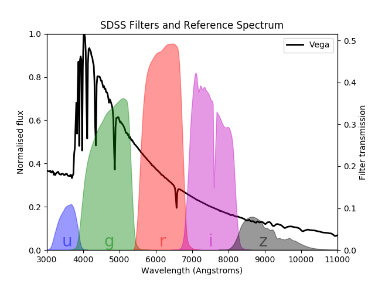

# Matplotlib

This task will be an exercise in Matplotlib and understanding documented code!. 
Please install `astroml` with `pip install astroml` so that we can access the data.

Matplotlib is sometimes hard and ugly but it is possible to make a nice plot!

The task today is to replicate the plot in `original.pdf`. The plot is of the Vega spectrum (taken from SDSS) and plotted with the SDSS filters. Try to emulate `original.pdf` as closely as possible!

The data to make it can be found in `data.py` or, more accurately, the functions to retrieve the data can be found in `data.py`. It is up to you to understand what `fetch_sdss_filter` and `fetch_vega_spectrum` do!

If you see something that you want to copy in matplotlib, google/stackoverflow is your friend!

Try to get as close as possible, but in the end it doesn't matter if it is not exactly the same!

